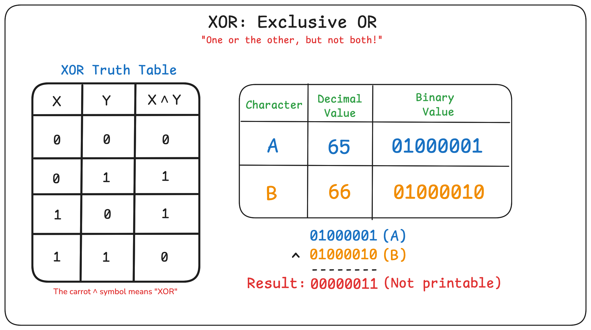

# Lockpick HTB - Malware Analysis

# Summary

This HTB challenge focuses on analyzing a binary used for ransomware. 

This repository serves as a placeholder for some of the code, diagrams, and notes taken during the analysis of the malware.

# Part 1: Malware Analysis VM Setup

1. Install Ubuntu 24.04 ISO
2. Create new VM using NAT
3. Install Malware Analysis Tools. Here's what I am currently using:
```bash
git clone git@gist.github.com:bb43cff3d6cd8942e6acc5e9d680460d.git
cd bb43cff3d6cd8942e6acc5e9d680460d/
chmod +x malware_analysis_tools.sh
./malware_analysis_tools.sh
``` 

4. Install Ghidra
5. Create a snapshot. I titled mine, "Golden Image"

# Part 2: Transferring Malware to VM

1. [Host OS] Make sure you are downloading a password protected archive containing malware.
2. [Host OS] Change network adapter to a custom virtual network, like `vmnet1`.
3. [Host OS] Start up VM
4. [VM] Start `sshd` in the VM and confirm it is running
```bash
sudo systemctl start ssh
sudo systemctl status ssh
```
 
5. [VM] Figure out the IP Address that your VM is using.
```bash
ifconfig
```

6. [Host OS] Gather the hash, and then transfer the password protected archive over `scp`. This will output to the home directory of the user.
```bash
sha256sum malware.zip
scp malware.zip user@172.16.1.100:
```

7. [VM] Confirm the archive was copied successfully.
```bash
sha256sum malware.zip
```

8. [Host OS] Shutdown the VM.
9. [Host OS] Remove the network adapter for the VM.
10. [Host OS] Start the VM again. You are now ready to analyze the malware.

# Part 3: Static Malware Analysis

1) What type of file are we working with? 

Let's take a look at byte offset `0000000`
```bash
hexdump bescrypt3.2 | head -1
``` 
We notice that the first few bytes begins with `45 7f 46 4c`. Take a look at https://www.garykessler.net/library/file_sigs_GCK_latest.html to determine what kind of file this is.

2) We can determine the file type using `file` as well:

```bash
file bescrypt3.2
```

3) Another starting point is to look at `strings`. We are not going to spend much time here, but we can see several strings that give away what the malware is doing.

4) We are able to see that the binary has strings like `encrypt_file`, and if we look at the forela data I think it's safe to say this is ransomware.

5) We need to figure out what kind of encryption this is using so we can decrypt our data. Let's pop open a tool called `Ghidra`.

6) In Ghidra, we are going to focus on identifying functions in decompiler mode so we can see the `C` code used to encrypt these files. 

7) Focus on `main()`, `process_directory`, and `encrypt_file`. 

8) `encrypt_file` is going to contain the most important data for this challenge.

Take a look at:

| File | Purpose |
| :------- | :------: |
| `original_encrypt.c` | Straight from decompiler |
| `simplified_encrypt.c` | Modified with new variables, comments, and some lines simplified |
| `encrypt.py` | Rewritten in Python| 

# Part 4: XOR



# Part 5: Writing `decrypt.py`

Using what we learned about XOR, we will write `decrypt.py` from scratch. 

You can use `decrypt/decrypt.py` for guidance.
